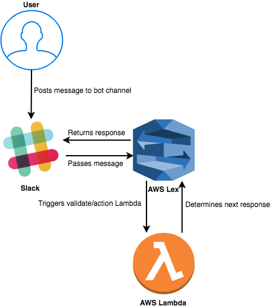

# Infra-Bot
How does that shit work?
---
### AWS Services
LEX & LAMBDA
+++
### Lex
- Builds conversational interfaces
- Automatic speech recognition (ASR)
- Natural language understanding (NLU)
+++
### Lambda
- Serverless Computing
- Pay for only what you use
- Supports Node.js, Python, Java, C#, Go
+++
### How does it all fit together?

---
## Lets have a look
+++?code=test.js&title=Validation Lambda Changes
@[1-4]test.js First Section of Code
@[5-8]test.js Second Section of Code
+++?code=test.js&title=Server Lambda Changes
@[1-4]test.js First Section of Code
@[5-8]test.js Second Section of Code
---
# Questions?
---
Checkout GitPitch if you liked the presentation, its super cool.