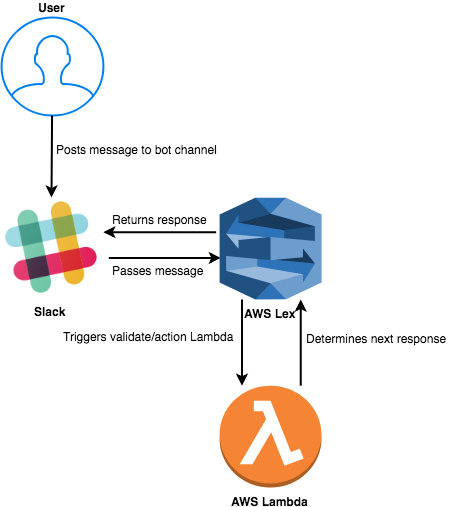

# Infra-Bot
How does that shit work?
---
### AWS Services
 
LEX & LAMBDA
+++
### Lex
###### It's the Lex in Alexa
- Builds conversational interfaces
- Automatic speech recognition (ASR)
- Natural language understanding (NLU)
+++
### Lambda
- Serverless Computing
- Pay for only what you use
+++
### What it looks like for Infra-Bot

---
### GitPitch is cool
Incoming code snippet
+++?code=test.js&title=Code Snippet
@[1-4]test.js First Section of Code
@[5-8]test.js Second Section of Code
---
# Fin