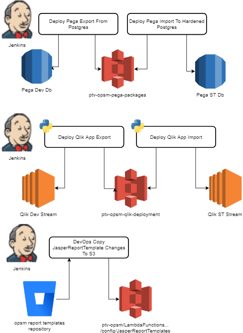

[comment]: <> (https://gitpitch.com/willstobo/spps-brownbags/master?p=jenkins-jobs)
# Jenkins Jobs
The link between environments
---
## Contents
- Jenkins
- Deployment Pipelines
- Pega Deployment Jobs
- Pega Deployment Pipeline
- Qlik Deployment Jobs
- Reporting Template Deployments
- Bitbucket webhooks
---
## Jenkins
Our deployment tool for SPPS
Jobs are either bash scripts or python scripts
---
## Deployment Pipelines

+++
## Pega Deployment Jobs
@ul
- bash scripts using prpcUtils pega script
@ulend
+++
## Pega Deployment Pipeline
@ul
- Groovy Script linking existing jenkins jobs together
@ulend
+++
## Qlik Deployment Jobs
@ul
- python scripts using Qlik api's
@ulend
+++
## Reporting Template Deployments
- bash scripts using aws cli
---
## Bitbucket webhooks
- notify Jenkins when a change has been made
---
# Questions?
