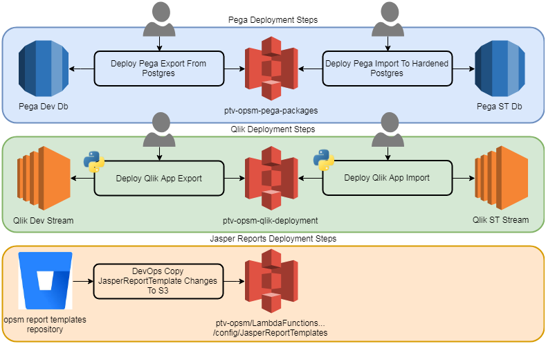

[comment]: <> (https://gitpitch.com/willstobo/spps-brownbags/master?p=jenkins-jobs)
# Jenkins Jobs
The link between environments
---
## Contents
- Jenkins
- Deployment Pipelines
- Pega Deployment Jobs
- Pega Deployment Pipeline
- Qlik Deployment Jobs
- Reporting Template Deployments
- Bitbucket webhooks
---
## Jenkins
Our deployment tool for SPPS
Jobs are configured with 
- Parameters
- Triggers
- Build Scripts
- Post Build Scripts
---
## Deployment Pipelines

+++
## Pega Deployment Jobs
@ul
- Parameters: Product Key, Version Number and Connection Details
- Triggers: Manual
- Build Scripts: Bash scripts using prpcUtils pega script
@ulend
+++
## Pega Deployment Pipeline
@ul
- Groovy Script linking existing jenkins jobs together
@ulend
+++
## Qlik Deployment Jobs
@ul
- Parameters: App Name, Version Number, Stream Name
- Trigger: Manual
- Build Scripts: Python scripts using Qlik api's
@ulend
+++
## Reporting Template Deployments
- Parameters: Branch Name
- Trigger: BitBucket Webhook
- Build Scripts: bash scripts using aws cli
---
## Bitbucket webhooks
- notify Jenkins when a change has been made
---
# Questions?
